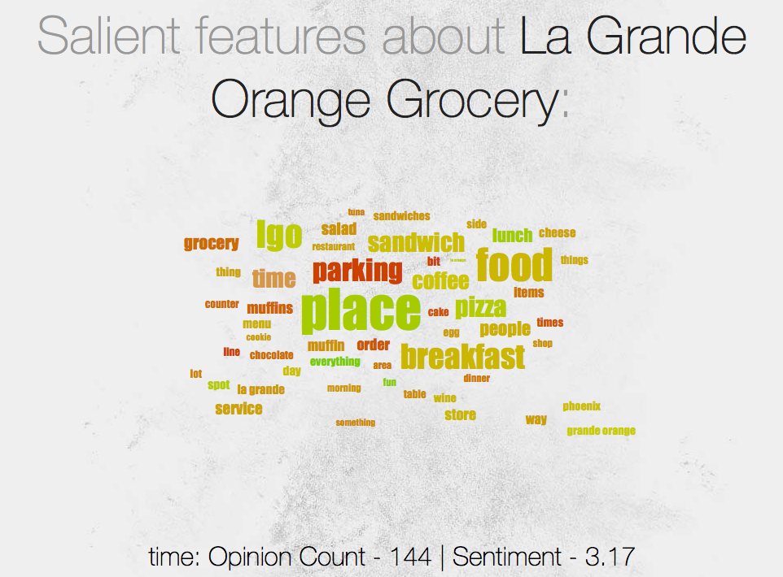

# Your Very Own Yelp®

Team HTTP501 from Georgia Tech presents a personalization solution to Yelp; as part of the Yelp Dataset Challenge 2014. This is a semester wide project built during the course of Data and Visual Analytics, CSE 6242 Spring 2014 at Georgia Tech.  
By - _Ameya Vilankar, Sagar Savla_

---

### There are three major parts to this project-
1. Review Summarization
2. User Ratings Prediction
3. Visualization  

#### There is a DOC folder that has additional resources:
1. Project Final Report
2. Project Final Presentation
Please refer to these resources for a detailed explanation of our project

---
## How To Run Each Part of this Project

Some parts of this project might require the source dataset which can
be found at https://www.yelp.com/dataset_challenge/dataset

1. Review Summarization  
Instructions on Compiling and Executing this part is in a separate
`Readme.txt` inside the subfolder `Review Summarization`

2. User Ratings Prediction  
Instructions on Compiling and Executing this part is in a separate
`Readme.txt` inside the subfolder `User Ratings Predictions`

3. Visualization  
Our static visualization can be run with any web browser which supports
most of the HTML5/CSS3 spec as of April 2014. We have tested it with
Mozilla Firefox v30.  
  1. To run the viz, please open the file `index.html` in the web browser.
  2. The main files are all located within the subfolder `Visualization`
   This folder is portable.
  3. A brief description of the main files:
    * `index.html`  
      The primary login screen. Being a static visualization mock-up,
      the interface is not connected to a backend login server. To
      pass the login screen, please enter any credentials in the Username
      and Password field and click on the login arrow to proceed

    * `map.html`  
      Our primary interface to show the user's personal rating
      predictions. Please hover on any of the markers to know the name of
      the place. The colour signifies how well we think the user would
      like it. Clicking on any of the markers shows you the feature cloud
      for the place.

    * `cloud.html`  
      This is the interface to showcase our review summarization features.
      The cloud represents a collection of salient features of the restaurant
      (or vice versa)  
      The colour of the feature words signifies the sentiment of the feature
      among the reviewers. Green means positive and Red tends to the negative.
      The size of the word signifies how prominent this feature is among all
      the reviews of the place.  
      Hovering on the word yields detailed information about the sentiment
      analysis and opinion count  
      Clicking on the feature makes another word cloud surrounding that
      feature/restaurant. The user can navigate back-and-forth with these
      links.

## Some snazzy screenshots!
1. Our Data Flow Diagram
  
2. The static mock-up login screen
  
3. The interactive map of restaurants near a user, colored (ranked) based on likeness
  
4. The feature wordcloud of one selected restaurant from step 3.
  
5. The reverse restaurant wordcloud of a selected feature from step 4.
  

This work is licensed under a Creative Commons Attribution-NonCommercial-ShareAlike 4.0 International License.
